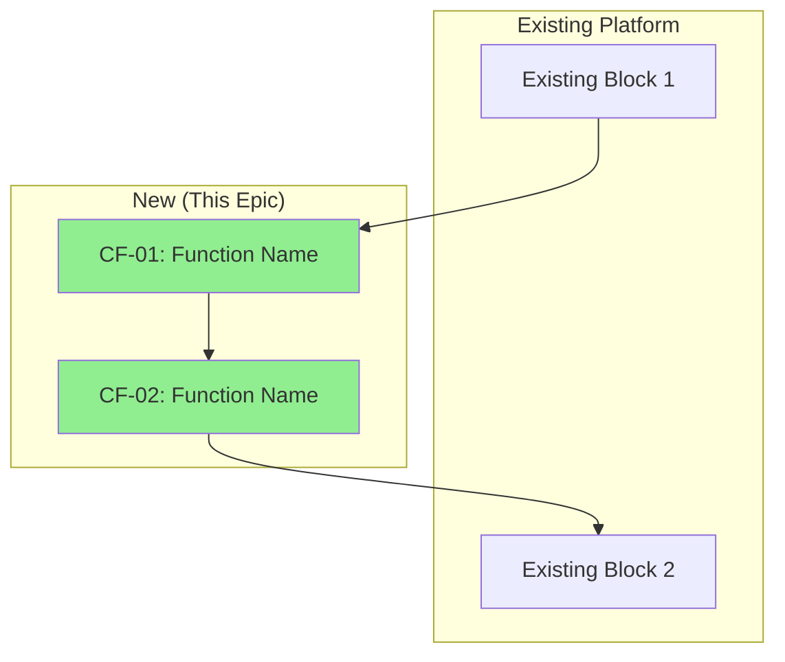

# /core-functions — Core Functions Documentation

<context>
**User Input**: $ARGUMENTS

**Current Git Status**: !`git status --short 2>/dev/null || echo "clean"`

**Current Branch**: !`git branch --show-current 2>/dev/null || echo "none"`

**Active Feature**: !`ls -td specs/[0-9]*-* 2>/dev/null | head -1 || echo "none"`

**Active Epic**: !`ls -td epics/[0-9]*-* 2>/dev/null | head -1 || echo "none"`

**Is Epic Context**: !`[ -d "$(ls -td epics/[0-9]*-* 2>/dev/null | head -1)" ] && echo "true" || echo "false"`

**Existing Core Functions**: !`find specs/*/core-functions.md epics/*/core-functions.md docs/core-functions.md -type f 2>/dev/null | head -5 || echo "none"`

**System Architecture**: @docs/project/system-architecture.md

**Validation Script**: .spec-flow/scripts/bash/validate-core-functions.sh
</context>

<objective>
Create, update, or visualize Core Functions — the logical transformation blocks that describe WHAT the product does (not how to build it).

**Core Functions are NOT**:
- Software components or modules (those go in system-architecture.md)
- Technical implementation details (those go in plan.md)
- User stories or requirements (those go in spec.md)

**Core Functions ARE**:
- Logical transformation steps from inputs to outputs
- Described in user-understandable language
- Named with max 3 significant words
- Focused on non-obvious transformations

**When to use**:
- **Epics**: Required — automatically prompted during /plan phase
- **Features (new capability)**: Recommended — when adding new logical transformations
- **Enhancements/Fixes**: Skip — not needed for modifications to existing functions

**Workflow integration**:
- `/epic` plan phase automatically prompts for Core Functions
- Can be invoked independently for features via `/core-functions create`
</objective>

## Anti-Hallucination Rules

**CRITICAL**: Follow these rules to prevent Core Functions quality issues.

1. **Never describe HOW to build it**
   - ❌ BAD: "Uses FastAPI to process requests through middleware"
   - ✅ GOOD: "Receives user request and determines execution approach"
   - Core Functions describe WHAT, not HOW

2. **Use user-understandable language**
   - ❌ BAD: "OrchestratorSelector invokes RuntimeFactory via DI"
   - ✅ GOOD: "Selects the right execution approach for each agent"
   - If a non-technical user can't understand it, rewrite it

3. **Function names max 3 significant words**
   - ❌ BAD: "Agent Runtime Selection And Execution Management"
   - ✅ GOOD: "Runtime Selection"
   - Filter articles (a, the, an) and prepositions when counting

4. **Document non-obvious logic**
   - If the transformation is straightforward (input → same output), skip it
   - Focus on transformations where something interesting happens
   - Example: "Weights recent lessons more heavily" is non-obvious

5. **Show platform integration**
   - Core Functions must show how new blocks connect to existing platform
   - Read system-architecture.md before generating diagrams
   - Never create isolated diagrams that don't show existing context

6. **Verify against spec.md**
   - Core Functions must trace back to user requirements
   - If a function doesn't serve a user story, question its necessity
   - Quote spec.md requirements when linking

7. **Never guess at existing platform blocks**
   - Read system-architecture.md or codebase before referencing existing blocks
   - If no architecture doc exists, scan codebase for major components
   - Quote actual component names, not invented ones

**Why this matters**: Core Functions bridge user requirements and technical implementation. Poor Core Functions create confusion and don't help stakeholders understand the product.

---

## Mental Model

You are documenting the **logical transformation blocks** of the product. Think of Core Functions as:

- **Input** → [**Core Function**] → **Output**
- What "magic" happens inside the box?
- Why is this transformation non-obvious?

**Good Core Function**:
```
CF-01: Progress Calculation

Input: Student's completed flight lessons
Output: Proficiency score mapped to FAA standards

Non-obvious: Weights recent lessons more heavily, adjusts for weather conditions
```

**Bad Core Function** (too technical):
```
CF-01: ACSCalculatorService

Input: LessonDTO[]
Output: ProficiencyScore entity

Non-obvious: Uses dependency injection to call repository layer
```

---

<process>

### Step 1: Determine Context

**Check if in epic or feature context:**

```bash
if [ -d "$(ls -td epics/[0-9]*-* 2>/dev/null | head -1)" ]; then
    CONTEXT="epic"
    WORK_DIR="$(ls -td epics/[0-9]*-* 2>/dev/null | head -1)"
    echo "✅ Epic context: $WORK_DIR"
elif [ -d "$(ls -td specs/[0-9]*-* 2>/dev/null | head -1)" ]; then
    CONTEXT="feature"
    WORK_DIR="$(ls -td specs/[0-9]*-* 2>/dev/null | head -1)"
    echo "✅ Feature context: $WORK_DIR"
else
    CONTEXT="project"
    WORK_DIR="docs"
    echo "✅ Project context: $WORK_DIR"
fi
```

### Step 2: Parse Arguments

**If $ARGUMENTS is empty**, display usage:

```
Usage: /core-functions "<action>: <description>"

Actions:
  create: <capability description>
  update: <CF-XX> | <section>=<...>
  list: [--epic | --feature | --all]
  diagram: [--update | --show]

Examples:
  /core-functions "create: Agent execution and runtime management"
  /core-functions "update: CF-02 | description=Updated transformation logic"
  /core-functions "diagram --update"
  /core-functions "list --all"
```

**If $ARGUMENTS provided**, parse the action type:
- Extract action: `create`, `update`, `list`, or `diagram`
- Extract description or CF number
- Display parsed request

### Step 3: Read Context (for create/update)

**CRITICAL**: Never create Core Functions without understanding the context.

1. **Read spec.md** (for user requirements):
   ```bash
   cat "$WORK_DIR/spec.md" 2>/dev/null || cat "$WORK_DIR/epic-spec.md" 2>/dev/null
   ```

2. **Read plan.md** (for planned capabilities):
   ```bash
   cat "$WORK_DIR/plan.md" 2>/dev/null
   ```

3. **Read system-architecture.md** (for existing platform blocks):
   ```bash
   cat docs/project/system-architecture.md 2>/dev/null
   ```

4. **Quote relevant sections**:
   ```
   Found in spec.md:
   - FR-001: "System MUST allow users to trigger agents"
   - FR-002: "System MUST track agent execution status"
   
   Found in system-architecture.md:
   - Existing: AgentService, ToolService, LLMService
   - Pattern: Factory + Strategy
   ```

### Step 4: Identify Core Functions

**For each user requirement, ask:**

1. What transformation happens?
2. What goes in? What comes out?
3. What's non-obvious about this transformation?
4. Does this connect to existing platform blocks?

**Create function inventory:**

| Requirement | Transformation | Non-Obvious? | New Block? |
|-------------|---------------|--------------|------------|
| FR-001 | Trigger → Execution | Yes (bounded wait) | Yes |
| FR-002 | Events → Status | Yes (best-effort) | Yes |

### Step 5: Generate Core Functions Document

**Use template from** `.spec-flow/templates/core-functions-template.md`

**For each Core Function, include:**

```markdown
### CF-XX: [Function Name (max 3 words)]

**Description**: [What does the product do? User-understandable language.]

**Input**: 
- [What the function receives — in user terms]

**Output**:
- [What the function produces — in user terms]

**Non-Obvious Logic**:
- [The transformation that isn't obvious to users]

**Traces to**: [spec.md requirement or user story]

**Connected Functions**:
- Receives from: [CF-XX or existing block]
- Sends to: [CF-XX or existing block]
```

### Step 6: Generate Block Diagram

**Create Mermaid diagram showing:**

1. **Existing platform blocks** (from system-architecture.md)
2. **New Core Functions** (highlighted)
3. **Connections** between them



### Step 7: Validate Core Functions

**Run validation script:**

```bash
bash .spec-flow/scripts/bash/validate-core-functions.sh "$WORK_DIR/core-functions.md"
```

**Validation checks:**
- Function names ≤ 3 significant words
- No technical jargon in descriptions
- Each function has input/output
- Non-obvious logic documented
- Block diagram present
- Traces to requirements

### Step 8: Link to Epic/Feature

**Update epic-spec.md or spec.md to reference Core Functions:**

```markdown
## Core Functions

**Reference**: @[WORK_DIR]/core-functions.md

| # | Function Name | Description |
|---|--------------|-------------|
| CF-01 | [Name] | [Brief description] |
| CF-02 | [Name] | [Brief description] |
```

### Step 9: Commit Changes

**Create atomic commit:**

```bash
git add "$WORK_DIR/core-functions.md"
git add "$WORK_DIR/epic-spec.md" "$WORK_DIR/spec.md" 2>/dev/null
git commit -m "core-functions: Create Core Functions for [epic/feature name]

🤖 Generated with Claude Code
Co-Authored-By: Claude <noreply@anthropic.com>" --no-verify
```

### Step 10: Display Summary

```
━━━━━━━━━━━━━━━━━━━━━━━━━━━━━━━━━━━━━━━━
CORE FUNCTIONS CREATED
━━━━━━━━━━━━━━━━━━━━━━━━━━━━━━━━━━━━━━━━

Created: $WORK_DIR/core-functions.md
Functions: [N] core functions documented
Context: $CONTEXT
Commit: {hash}

### 📋 Next Steps

1. Review: Read core-functions.md
2. Validate: Ensure all transformations are non-obvious
3. Diagram: Check block diagram shows platform integration
4. Continue: Proceed with /plan or /tasks
```

</process>

<success_criteria>
**Core Functions successfully created when:**

1. **Document structure correct**:
   - All CF-XX entries have required fields
   - Function names ≤ 3 significant words
   - Descriptions use user-understandable language

2. **Content quality**:
   - Each function describes WHAT (not HOW)
   - Non-obvious logic is documented
   - Input/Output mapping is clear

3. **Platform integration**:
   - Block diagram shows existing platform blocks
   - New functions are highlighted
   - Connections are documented

4. **Traceability**:
   - Each function traces to spec.md requirement
   - Epic-spec.md updated with reference

5. **Validation passed**:
   - Validation script reports no errors
</success_criteria>

<verification>
**Before marking complete, verify:**

1. **Read created file**:
   ```bash
   cat "$WORK_DIR/core-functions.md"
   ```

2. **Check function count**:
   ```bash
   grep -c "^### CF-" "$WORK_DIR/core-functions.md"
   ```

3. **Check for technical jargon** (should return 0):
   ```bash
   grep -iE "(service|repository|middleware|factory|controller|DTO|entity)" "$WORK_DIR/core-functions.md" | wc -l
   ```

4. **Check block diagram exists**:
   ```bash
   grep -q "```mermaid" "$WORK_DIR/core-functions.md" && echo "✅ Diagram present" || echo "❌ Missing diagram"
   ```

5. **Verify git commit**:
   ```bash
   git log -1 --oneline
   ```
</verification>

---

## Examples

### Good Core Functions Example

```markdown
# Core Functions: Agent Platform - Deep Agents

## Core Function Index

| # | Function Name | Input → Output |
|---|--------------|----------------|
| CF-01 | Agent Triggering | Request → Result or Tracking ID |
| CF-02 | Runtime Selection | Agent definition → Execution approach |
| CF-03 | Tool Execution | Tool request → Tool result |

---

### CF-01: Agent Triggering

**Description**: Starts an agent to perform a task. Returns a result immediately if fast, or a tracking ID if the agent needs more time.

**Input**: 
- Which agent to run (agent ID)
- What to do (user context)

**Output**:
- Completed result (if finished quickly)
- Tracking ID (if still working)

**Non-Obvious Logic**:
- System waits up to 1 second for completion
- If not done in 1 second, returns tracking ID instead of blocking
- User can check status later using tracking ID

**Traces to**: FR-001 "System MUST allow users to trigger agents"

**Connected Functions**:
- Receives from: User/API
- Sends to: CF-02 (Runtime Selection)
```

### Bad Core Functions Example (What NOT to Do)

```markdown
### CF-01: AgentOrchestrator

**Description**: Uses dependency injection to instantiate the appropriate orchestrator via OrchestratorFactory based on OrchestratorSelector policy.

**Input**: 
- AgentRunRequest DTO

**Output**:
- AgentRunResponse with COMPLETED status or RUNNING status with run_id

**Non-Obvious Logic**:
- Factory pattern with strategy selection
- Async execution via asyncio.gather()

**Connected Functions**:
- Receives from: FastAPI endpoint handler
- Sends to: LangGraphOrchestrator or DeepAgentOrchestrator
```

**Why this is bad:**
- ❌ Function name is technical (AgentOrchestrator)
- ❌ Description uses jargon (dependency injection, factory)
- ❌ Input/Output are technical (DTO, status codes)
- ❌ Non-obvious logic is about implementation, not transformation

---

## Notes

### Core Functions vs Other Documentation

| Artifact | Describes | Language | Audience |
|----------|-----------|----------|----------|
| spec.md | What users want | User-facing | Product + Engineering |
| core-functions.md | What product does | User-facing | Product + Engineering + Stakeholders |
| plan.md | How to build it | Technical | Engineering |
| system-architecture.md | Software components | Technical | Engineering |

### Integration with Epic Workflow

Core Functions are automatically prompted during `/epic` plan phase:
1. `/epic` runs plan phase
2. Plan phase detects epic context
3. Prompts: "Create Core Functions for this epic?"
4. If yes, invokes `/core-functions create`
5. Core Functions linked in epic-spec.md

### Standalone Usage

For features or independent documentation:
```bash
/core-functions "create: User authentication and session management"
```

---

## References

- Template: `.spec-flow/templates/core-functions-template.md`
- Validation: `.spec-flow/scripts/bash/validate-core-functions.sh`
- Related commands: `/itd`, `/plan`, `/epic`

