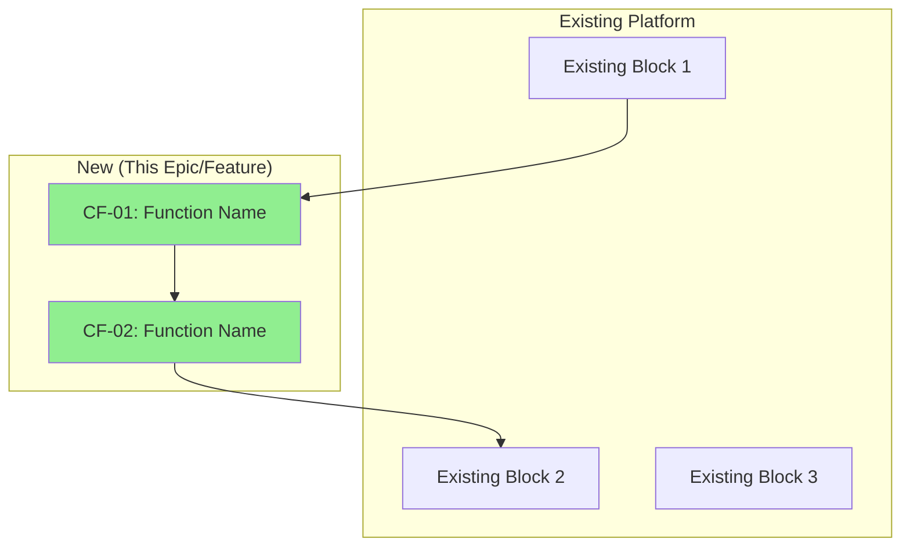
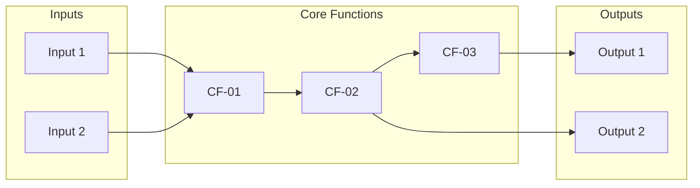

# Core Functions: [Epic/Feature Name]

**Last Updated**: [DATE]
**Scope**: [Epic | Feature]
**Spec Reference**: @[path-to-spec.md]
**Plan Reference**: @[path-to-plan.md]

---

## Purpose

This document describes **what the product does** (not how it's built). It maps the logical transformations from inputs to outputs in user-understandable terms.

**Audience**: Product managers, stakeholders, engineers
**Language**: Non-technical, user-facing

---

## Core Function Index

| # | Function Name | Description | Input → Output |
|---|--------------|-------------|----------------|
| CF-01 | [Name] | [Brief description] | [In] → [Out] |
| CF-02 | [Name] | [Brief description] | [In] → [Out] |
| CF-03 | [Name] | [Brief description] | [In] → [Out] |

---

## Core Functions

### CF-01: [Function Name (max 3 significant words)]

**Description**: [What does the product do that helps solve the customer problem? User-understandable language, no technical jargon.]

**Input**: 
- [What the function receives — in user terms]
- [Example: "Student's completed flight lessons"]

**Output**:
- [What the function produces — in user terms]
- [Example: "Proficiency score mapped to FAA standards"]

**Non-Obvious Logic**:
- [The transformation that isn't obvious to users]
- [Example: "Weights recent lessons more heavily than older ones"]

**Traces to**: [spec.md requirement ID, e.g., FR-001, US-003]

**Connected Functions**:
- Receives from: [CF-XX | Existing Block | User/External]
- Sends to: [CF-XX | Existing Block | User/External]

---

### CF-02: [Function Name]

**Description**: [Description]

**Input**: 
- [Input]

**Output**:
- [Output]

**Non-Obvious Logic**:
- [Logic]

**Traces to**: [Requirement]

**Connected Functions**:
- Receives from: [Source]
- Sends to: [Destination]

---

### CF-03: [Function Name]

**Description**: [Description]

**Input**: 
- [Input]

**Output**:
- [Output]

**Non-Obvious Logic**:
- [Logic]

**Traces to**: [Requirement]

**Connected Functions**:
- Receives from: [Source]
- Sends to: [Destination]

---

## Functional Block Diagram

### Platform Overview (Where This Epic/Feature Fits)

### Core Function Flow (Detailed)

---

## Platform Integration

### Existing Blocks Referenced

| Block Name | Purpose | How This Epic Connects |
|------------|---------|------------------------|
| [Block 1] | [What it does] | CF-01 receives from this block |
| [Block 2] | [What it does] | CF-03 sends to this block |

### New Blocks Introduced

| Block Name | Purpose | Integrates With |
|------------|---------|-----------------|
| CF-01 | [What it does] | [Block 1] → CF-01 → CF-02 |
| CF-02 | [What it does] | CF-01 → CF-02 → [Block 2] |

---

## Traceability Matrix

| Core Function | Traces to Requirement | User Story |
|--------------|----------------------|------------|
| CF-01 | FR-001 | US-001 |
| CF-02 | FR-002 | US-002 |
| CF-03 | FR-003, FR-004 | US-003 |

---

## Validation Checklist

- [ ] Each function name is max 3 significant words
- [ ] Descriptions use user-understandable language (no jargon)
- [ ] No function describes HOW to build it (only WHAT it does)
- [ ] Non-obvious logic is documented for each function
- [ ] Block diagram shows integration with existing platform
- [ ] All inputs and outputs are identified
- [ ] Each function traces to a spec requirement

