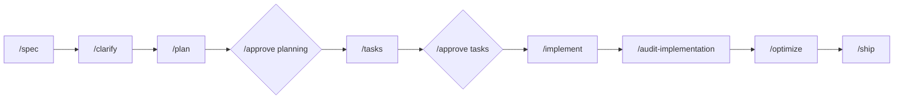

<div align="center">
  <h1>Spec-Flow</h1>
  <p><strong>Ship features faster with AI-powered spec-driven development.</strong></p>

  <p>
    <a href="https://github.com/shipsy/Spec-Flow/blob/main/LICENSE">
      
    </a>
    <a href="https://github.com/shipsy/Spec-Flow/stargazers">
      
    </a>
  </p>
</div>

---

Spec-Flow is a workflow toolkit for [Claude Code](https://claude.ai/code) that transforms how you build software with AI. Instead of ad-hoc prompting, you get a structured pipeline that takes ideas from specification to production.

```
/feature "add user authentication"
```

That's it. Spec-Flow handles the rest: writing specs, planning architecture, breaking down tasks, implementing with TDD, running quality gates, and deploying.

## Why Spec-Flow?

| Without Spec-Flow | With Spec-Flow |
|-------------------|----------------|
| "What were we building again?" | Every decision tracked in NOTES.md |
| Features shipped without tests | TDD enforced, quality gates block bad code |
| Context bloat slows Claude down | Auto-compaction keeps context efficient |
| Each feature starts from scratch | Reusable patterns, proven workflows |
| "Did we test this? Who approved?" | Auditable artifacts for every phase |

## Quick Start

### 1. Install as Git Submodule

```bash
# Add Spec-Flow as a submodule in your project root
git submodule add https://github.com/shipsy/Spec-Flow.git .spec-flow-src

# Copy workflow directories into your project
cp -r .spec-flow-src/.claude .
cp -r .spec-flow-src/.spec-flow .

# Append Spec-Flow rules to existing files (see "Multi-Agent Integration" section below)
# - CLAUDE.md: Copy or merge full CLAUDE.md from .spec-flow-src/CLAUDE.md
# - AGENTS.md: Append Spec-Flow agent coordination rules
# - .cursorrules: Append Spec-Flow enforcement rules

# Commit the submodule and copied files
git add .gitmodules .spec-flow-src .claude .spec-flow
git commit -m "chore: add Spec-Flow workflow"
```

This keeps Spec-Flow as a tracked submodule, making updates easy while the workflow files become part of your codebase.

### 2. Build your first feature

```bash
/feature "add dark mode toggle"
```

Spec-Flow runs you through:

```
spec → clarify → plan → [APPROVAL] → tasks → [APPROVAL] → implement → audit → optimize → ship
```

Each phase produces artifacts, approval gates ensure human oversight, and quality checks run before deployment.

### 3. That's it

Your feature is deployed. All decisions documented. Tests passing. Ready for the next one.

### Staying Updated

Pull the latest Spec-Flow changes:

```bash
# Update the submodule
cd .spec-flow-src
git pull origin main
cd ..

# Re-copy updated files (backup your customizations first)
cp -r .spec-flow-src/.claude .
cp -r .spec-flow-src/.spec-flow .

git add .claude .spec-flow
git commit -m "chore: update Spec-Flow to latest"
```

### Cloning a Project with Spec-Flow

When cloning a project that uses Spec-Flow as a submodule:

```bash
git clone --recurse-submodules <your-project-url>

# Or if already cloned:
git submodule update --init --recursive
```

---

## Workflow Overview



## The Workflow

### Features (< 16 hours)

For focused work on a single subsystem:

```bash
/feature "user profile editing"     # Start the workflow
/feature continue                   # Resume after a break
```

### Epics (> 16 hours)

For complex work spanning multiple subsystems:

```bash
/epic "OAuth 2.1 authentication"    # Multi-sprint orchestration
/epic continue                      # Resume epic work
```

Epics break down into parallel sprints with locked API contracts, giving you 3-5x velocity through parallelization.

### Quick fixes (< 30 min)

For small changes that don't need the full workflow:

```bash
/quick "fix login button alignment"
```

## Commands

### Core Workflow

| Command | What it does |
|---------|--------------|
| `/feature "name"` | Start a feature workflow |
| `/epic "goal"` | Start a multi-sprint epic |
| `/quick "fix"` | Fast path for small changes |
| `/help` | Context-aware guidance |

### Phase Commands

| Command | Phase |
|---------|-------|
| `/spec` | Generate specification |
| `/clarify` | Refine spec with stakeholder Q&A |
| `/plan` | Create implementation plan |
| `/tasks` | Break down into TDD tasks |
| `/implement` | Execute tasks |
| `/audit-implementation` | Detect drift between spec and code |
| `/optimize` | Run quality gates |
| `/ship` | Deploy to staging/production |

### Approval Gates

| Command | What it does |
|---------|--------------|
| `/approve planning` | Approve plan.md, ITDs, core-functions → unlock `/tasks` |
| `/approve tasks` | Approve tasks.md → unlock `/implement` |

### Artifact Commands

| Command | What it does |
|---------|--------------|
| `/itd "create: topic"` | Create Important Technical Decision ([details](#itds-important-technical-decisions)) |
| `/core-functions "create: desc"` | Document product core functions ([details](#core-functions)) |

### Project Setup

| Command | What it does |
|---------|--------------|
| `/init-project` | Generate project documentation |
| `/init-preferences` | Configure workflow defaults |
| `/roadmap` | Manage features via GitHub Issues |

See [all 46 commands](docs/commands.md) in the full reference.

## How It Works

### 1. Specification Phase

```bash
/spec "user authentication"
```

Generates `spec.md` with:

- User scenarios in Gherkin format
- Functional and non-functional requirements
- Acceptance criteria
- Success metrics

### 2. Clarification Phase

```bash
/clarify
```

Refines the specification through:

- Stakeholder Q&A to resolve ambiguities
- Edge case identification
- Constraint validation
- Requirement prioritization

### 3. Planning Phase

```bash
/plan
```

Creates `plan.md` with:

- Architecture decisions
- Component breakdown
- Code reuse opportunities
- Risk assessment

Also generates:
- **ITDs** — Important Technical Decisions for architectural choices
- **Core Functions** — What the product does (for epics)

### 4. Planning Approval Gate

```bash
/approve planning
```

**Mandatory checkpoint** before task breakdown:

- Reviews plan.md, ITDs, and core-functions.md
- Sets `approvals.planning = true` in state.yaml
- Unlocks the `/tasks` command

### 5. Task Breakdown

```bash
/tasks
```

Produces `tasks.md` with:

- 20-30 concrete implementation tasks
- TDD sequencing (Red → Green → Refactor)
- Dependency ordering
- Acceptance criteria per task

### 6. Tasks Approval Gate

```bash
/approve tasks
```

**Mandatory checkpoint** before implementation:

- Reviews tasks.md for completeness
- Sets `approvals.tasks = true` in state.yaml
- Unlocks the `/implement` command

### 7. Implementation

```bash
/implement
```

Executes tasks with:

- Test-first development
- Specialist agents (backend, frontend, database)
- Parallel batch execution
- Automatic error recovery

### 8. Implementation Audit

```bash
/audit-implementation
```

Verifies code matches spec/plan/tasks:

- 6-pass drift detection
- Requirement traceability check
- Scope creep identification
- Architecture compliance validation

### 9. Quality Gates

```bash
/optimize
```

Runs parallel checks:

- Performance benchmarks
- Security scanning
- Accessibility audits
- Code review
- Test coverage validation

### 10. Deployment

```bash
/ship
```

Handles:

- Staging deployment
- Validation checks
- Production promotion
- Rollback capability

## Planning Artifacts

Spec-Flow generates structured planning artifacts that ensure implementation aligns with requirements.

> **Commands**: [`/itd`](#artifact-commands) | [`/core-functions`](#artifact-commands)

### ITDs (Important Technical Decisions)

ITDs document architectural choices with significant impact—decisions that are hard to change later.

```bash
/itd "create: Database selection for analytics workload"
```

**Structure**:
- **Problem**: Technical challenge (not a solution)
- **Options Considered**: 2+ viable alternatives
- **Reasoning**: Tradeoffs, cost analysis, why alternatives rejected
- **References**: Links to docs, benchmarks, related decisions

**When to create ITDs**:
- Database, framework, or architecture pattern selection
- Performance/security decisions with tradeoffs
- Tool selection requiring cost analysis (free vs paid)
- Best practices for repeated decisions

**Location**: `specs/NNN-feature/itds/` or `epics/NNN-epic/itds/`

### Core Functions

Core Functions describe **what the product does** (not how it's built) in user-understandable language.

```bash
/core-functions "create: Agent execution and runtime management"
```

**Format**:

```
Input → [Core Function] → Output

Non-Obvious Logic: What transformation happens that isn't obvious
```

**Example**:
> **CF-01: Progress Calculation**
> - Input: Student's completed flight lessons
> - Output: Proficiency score mapped to FAA standards
> - Non-obvious: Weights recent lessons more heavily, adjusts for weather

**When to use**:
- **Epics**: Required—automatically prompted during `/plan`
- **Features**: Optional—recommended when adding new capabilities

**Location**: `core-functions.md` in feature/epic directory

## Approval Flow

Spec-Flow enforces **mandatory approval gates** before implementation can begin.

> **Commands**: [`/approve planning`](#approval-gates) | [`/approve tasks`](#approval-gates)

```
/spec → /clarify → /plan → [APPROVAL] → /tasks → [APPROVAL] → /implement → /audit → /optimize → /ship
```

### Gate 1: Planning Approval

After `/plan` completes:

```bash
/approve planning
```

- **Approves**: `plan.md`, `core-functions.md`, `itds/*.md`
- **Unlocks**: `/tasks` command
- **Blocked if**: `approvals.planning = false` in `state.yaml`

### Gate 2: Tasks Approval

After `/tasks` completes:

```bash
/approve tasks
```

- **Approves**: `tasks.md`
- **Unlocks**: `/implement` command
- **Blocked if**: `approvals.tasks = false` in `state.yaml`

### Why Approval Gates?

1. **Prevents premature implementation** before design review
2. **Ensures validation** of core-functions, ITDs, and task breakdown
3. **Creates explicit checkpoints** for human oversight
4. **Reduces rework** from implementing wrong specifications

## Implementation Drift Detection

After implementation, `/audit-implementation` verifies that code matches spec, plan, and tasks.

> **Command**: [`/audit-implementation`](#phase-commands)

```bash
/audit-implementation
```

### 6 Verification Passes

| Pass | Name | What It Checks |
|------|------|----------------|
| 1 | Task Completion | Completed tasks have corresponding commits |
| 2 | Requirement Traceability | Every FR-XXX has implementing code |
| 3 | Architecture Compliance | Code structure matches plan.md |
| 4 | Scope Creep | Changes not traced to requirements/tasks |
| 5 | Core Functions | CF-XX functions are implemented |
| 6 | ITD Compliance | Technical decisions were followed |

### Audit Statuses

| Status | Meaning | Next Step |
|--------|---------|-----------|
| `PASS` | Implementation aligns with spec/plan/tasks | Proceed to `/optimize` |
| `NEEDS_REVIEW` | >3 major findings | Review and fix or accept |
| `FAIL` | Critical issues found | Fix before proceeding |

**Workflow position**: `implement → audit-implementation → optimize`

## Multi-Agent Integration

Spec-Flow coordinates multiple AI agents (Claude Code, Cursor, Codex) through a shared canon. If your project already has `CLAUDE.md`, `AGENTS.md`, or `.cursorrules` files, **append** the Spec-Flow rules rather than overwriting them.

### Append to CLAUDE.md

If your project has an existing `CLAUDE.md` file, manually append the full Spec-Flow workflow instructions:

```bash
# Append the full Spec-Flow CLAUDE.md content to your existing file
cat .spec-flow-src/CLAUDE.md >> CLAUDE.md
```

**Note**: If your `CLAUDE.md` is empty, simply copy the entire file:

```bash
cp .spec-flow-src/CLAUDE.md .
```

The root `CLAUDE.md` in this Spec-Flow repository contains the full workflow instructions (475 lines) following the WHAT/WHY/HOW framework, including all commands, deployment models, quality gates, and deep references.

### Append to AGENTS.md

If your project has an existing `AGENTS.md` file, append this section:

```markdown
## Spec-Flow Agent Coordination

- `.spec-flow/` holds the canonical workflow docs, repo map, state schemas, memory, and automation scripts
- `epics/<slug>/state.yaml` is the single source of truth for epic phase progress
- `.claude/` is read-only for non-Claude agents—use as reference only
- `.cursor/` is for Cursor-specific prompts and adapters
- When progressing any phase, update `state.yaml` and stop at approval gates
- Persistent learnings belong in `.spec-flow/memory/`
```

### Append to .cursorrules

If your project has an existing `.cursorrules` file, add these lines:

```
# Spec-Flow Enforcement
- Read .spec-flow/ENFORCE.md before any code modifications
- Check approvals.planning and approvals.tasks in state.yaml
- Follow TDD enforcement for implementation tasks
- Reference .claude/commands/ for phase behavior patterns
```

### Key Rules for Multi-Agent Coordination

1. **Shared canon** lives in `.spec-flow/` (repo map, domain guides, state schemas)
2. **`.claude/` is read-only** for non-Claude agents—use as reference only
3. **Cursor-specific files** belong in `.cursor/`
4. **Run one phase per session** unless explicitly chaining
5. **Honor approval gates**—check `state.yaml` before implementation

## Project Structure

```
your-project/
├── .claude/
│   ├── commands/         # Slash commands
│   ├── agents/           # Specialist agent briefs
│   ├── skills/           # Progressive disclosure content
│   └── hooks/            # Event handlers
├── .spec-flow/
│   ├── scripts/          # Automation scripts
│   ├── config/           # User preferences
│   └── templates/        # Artifact templates
├── specs/
│   └── NNN-feature/      # Feature workspaces
├── epics/
│   └── NNN-epic/         # Epic workspaces
└── docs/
    └── project/          # Project documentation
```

## Using with Gemini CLI

Spec-Flow can be installed as a Gemini CLI extension to bring the same structured workflow to Gemini.

1. **Install**:

    ```bash
    # From within your project root
    npx spec-flow install-gemini-extension
    ```

    *Alternatively, run: `gemini extensions install .` inside your project.*

2. **Use**:
    The extension provides the same slash commands (`/feature`, `/plan`, etc.) directly within your Gemini CLI session.

    ```
    /feature "add user authentication"
    ```

3. **Skills & Agents**:
    The Gemini extension automatically adapts Spec-Flow's agents and skills to work within the Gemini environment, allowing you to leverage specialized personas like `backend-dev` or `git-workflow-enforcer`.

## Requirements

- **Claude Code** with slash command support
- **Git** 2.39+
- **Python** 3.10+
- **yq** 4.0+ for YAML processing

Windows users: Install [Git for Windows](https://git-scm.com/download/win) for full compatibility.

## Documentation

| Guide | Description |
|-------|-------------|
| [Getting Started](docs/getting-started.md) | Step-by-step tutorial |
| [Developer Guide](docs/developer-guide.md) | Complete reference |
| [Commands Reference](docs/commands.md) | All slash commands |
| [Architecture](docs/architecture.md) | System design |
| [Troubleshooting](docs/troubleshooting.md) | Common issues |

## Examples

See a complete feature workflow in [`specs/001-example-feature/`](specs/001-example-feature/):

- Full specification with requirements
- 28 tasks with acceptance criteria
- Performance benchmarks
- Release notes

## 🆕 Recent Updates

### v11.9.0 (December 2025)

**shadcn/ui Integration with Token Bridge Pattern** - Generate OKLCH tokens + shadcn-compatible CSS variables

- **8 customization options**: Style Preset, Base Color, Theme Mode, Icon Library, Font Family, Border Radius, Menu Color, Menu Accent
- **Token Bridge Pattern**: OKLCH tokens remain source of truth, shadcn CSS variable aliases generated
- **Brownfield scanning**: Auto-detect and consolidate existing color tokens
- **Menu theming**: New menu-specific tokens for background, hover, active, and accent styles

**Ultrathink Philosophy Checkpoints** - Deep thinking embedded across all workflow phases

- **Phase checkpoints**: Think Different (spec), Obsess+Simplify (plan), Simplify Ruthlessly (tasks), Craft Don't Code (implement)
- **Progressive depth**: Trivial → Standard → Complex → Epic with increasing thinking requirements
- **Assumption inventory**: Question everything before designing
- **Complexity budgets**: Justify each new component

---

### v11.7.0 (December 2025)

**Auto-Mode for End-to-End Workflow Execution** - Run entire workflows without stopping

- **`--auto` flag**: Added to `/feature` and `/epic` commands
  - Continue automatically through optimize → ship → finalize
  - Skip manual approval prompts
  - Auto-merge PR when CI passes (controlled by preference)
- **`/ship --auto`**: Full autopilot for deployment phase
- **New preferences**: `deployment.auto_ship`, `deployment.auto_merge`, `deployment.auto_finalize`
- **Full autopilot**: `/feature "add auth" --auto` runs entire workflow unattended

---

### v11.5.0 (December 2025)

**CLI Version Awareness** - Stay current with automatic update detection

- **Version checking**: `npx spec-flow status` shows installed vs latest version
  - Fetches from npm registry with graceful offline handling
  - Clear "update available" indicator when behind
- **CI/CD integration**: `--check` flag exits code 1 if update available
- **Bug fix**: Fixed healthCheck variable shadowing bug

---

### v11.3.0 (December 2025)

**Git Worktree Integration** - Parallel development with isolated git state per feature/epic

- **worktree-context.sh**: Root orchestration utilities for worktree-based development
  - Automatic worktree creation for features/epics
  - Merge and cleanup functions for ship workflow
  - Task() agent context generation with cd-first pattern
- **Worktree-aware agents**: Worker agent supports isolated worktree execution
- **Command integration**: `/feature`, `/implement-epic`, `/ship` now create and manage worktrees
- **Enabled by default**: `worktrees.auto_create: true` - reduces merge conflicts ~90%

---

### v11.2.0 (December 2025)

**Automatic Regression Test Generation** - Bugs captured as tests to prevent recurrence

- **regression-test-generator skill**: Auto-generates framework-specific regression tests
  - Framework auto-detection (Jest, Vitest, pytest, Playwright)
  - Arrange-Act-Assert test structure with error ID references
  - Links tests back to error-log.md entries
- **Auto-invoke /debug on test failures**: When tests fail during `/implement`, `/debug` is automatically invoked
  - Generates regression test for the failure (Step 3.5)
  - Updates error-log.md with test reference
- **Continuous checks integration**: Check 7/7 triggers auto-debug on test failures

---

### v11.1.0 (December 2025)

**/quick Command - Task() Orchestrator Pattern** - Consistent architecture across all workflow commands

- **quick-worker agent**: Isolated agent for atomic quick change execution
  - Domain detection (backend/frontend/test/docs)
  - Test framework detection and execution
  - Style guide validation (UI changes)
  - Automatic commit with conventional message
- **Delimiter-based returns**: `---COMPLETED---`, `---NEEDS_INPUT---`, `---FAILED---`
- **Full Q&A support**: Test failure decisions batched to main context

---

### v11.0.0 (December 2025)

**Imperative Task() Architecture** - Commands now properly spawn isolated agents

- **Breaking Change**: `/feature` and `/epic` commands rewritten to use imperative Task() spawning
  - Phase agents now return structured delimiters (`---COMPLETED---`, `---NEEDS_INPUT---`, `---FAILED---`)
  - Questions batch to main context - agents return questions, main asks user, re-spawns with answers
  - Parallel sprint execution for epics via `run_in_background: true`
- **Ultra-lightweight Orchestrator Pattern**
  - Read state from disk, spawn isolated agents, handle Q&A, update state
  - Never carry implementation details in context
  - Unlimited feature/epic complexity (no context overflow)
- **Updated Agents**:
  - `spec-agent.md`, `plan-agent.md`: Delimiter-based return format
  - `worker.md`: WORKER_COMPLETED, WORKER_FAILED, ALL_DONE, BLOCKED delimiters
  - `initializer.md`: INITIALIZED, INIT_FAILED delimiters

---

### v10.17.0 (December 2025)

**Domain Memory v2 - Full Phase Isolation** - Revolutionary architecture preventing context overflow

- **Domain Memory System** - Persistent disk-based state for unlimited iterations
  - Workers pick ONE task, implement, test, update disk, exit
  - Zero shared context between workers (prevents overflow)
  - 13-command CLI for state management
- **Phase Isolation Pattern** - All phases spawn isolated agents via Task()
  - Question batching: agents return questions, main asks user, agents resume
  - Resumable at any point via interaction-state.yaml
- **Project Setup Agents** - Hybrid pattern for /init-project, /prototype, /roadmap
  - Questionnaire inline, heavy generation isolated
- **mgrep Semantic Search** - Find code by meaning, not exact text
  - Integrated as PRIMARY search in anti-duplication skill
  - Added to agent boot-up rituals

---

### v10.16.0 (December 2025)

**Quality Feedback Loop System** - Multi-agent voting, continuous checks, and perpetual learning

- **Multi-Agent Voting** - Error decorrelation through diverse sampling (MAKER algorithm)
  - 3-agent voting with k=2 strategy for code reviews, security audits, breaking changes
  - Temperature variation (0.5, 0.7, 0.9) decorrelates errors across agents
  - Automatic in `/optimize` phase, manual via `/review --voting`
- **Continuous Quality Checks** - Lightweight validation during `/implement` phase
  - Runs after each task batch (3-4 tasks), < 30s performance target
  - 6 checks: linting (auto-fix), type checking, unit tests, coverage delta, dead code, gap detection
  - Non-blocking warnings with user choice: fix now, continue, or abort
- **Progressive Quality Gates** - Three escalating levels throughout workflow
  - Level 1: Continuous (after each batch, < 30s, warn & continue)
  - Level 2: Full quality gates (`/optimize` phase, 10-15m, block deployment)
  - Level 3: Critical pre-flight (`/ship`, < 2m, block production)
- **On-Demand Review** - New `/review` command for anytime code review
  - Quick review (single agent, ~2-3 min) or comprehensive voting review (3 agents, ~5-8 min)
  - Auto-fix linting, extract file:line references, generate coverage gaps
- **Perpetual Learning** - Auto-apply proven patterns at workflow start
  - Performance optimizations (≥0.90 confidence) auto-applied
  - Anti-patterns (≥0.85 confidence) generate warnings
  - Custom abbreviations (≥0.95 confidence) auto-expanded
- **Early Gap Detection** - Find missing implementations before staging validation
  - Scans for TODO/FIXME/HACK comments, placeholders, edge cases
  - High-confidence gaps (≥0.8) flag likely issues before deployment

---

### v10.15.1 (December 2025)

**Command Architecture Optimization** - Cleaner package structure with 27% size reduction

- **Consolidated Commands**: Merged 11 archived commands into 4 active commands
  - `/gate` now handles both CI and security gates
  - `/create` consolidated 6 creation commands
  - `/context` merged session management commands
  - `/init` updated routing to new active paths
- **Optimized Distribution**: Excluded 48 archived commands from npm package
  - Package size: 8.5 MB → 6.27 MB (27% reduction)
  - Archived commands accessible via GitHub source only
  - All essential functionality in 30 active commands
- **Moved Essential Commands**: Project, deployment, and meta commands organized in active directories

---

## Contributing

See [CONTRIBUTING.md](CONTRIBUTING.md) for guidelines.

## Changelog

See [CHANGELOG.md](CHANGELOG.md) for version history and release notes.

## License

MIT License - see [LICENSE](LICENSE) for details.

---

<div align="center">
  <p>Originally built by <a href="https://x.com/marcusgoll">@marcusgoll</a> · Fork maintained by <a href="https://github.com/shipsy">@shipsy</a></p>
  <p>
    <a href="https://github.com/shipsy/Spec-Flow/issues">Report a bug</a> ·
    <a href="https://github.com/shipsy/Spec-Flow/discussions">Ask a question</a> ·
    <a href="https://github.com/shipsy/Spec-Flow/stargazers">Star on GitHub</a>
  </p>
</div>
